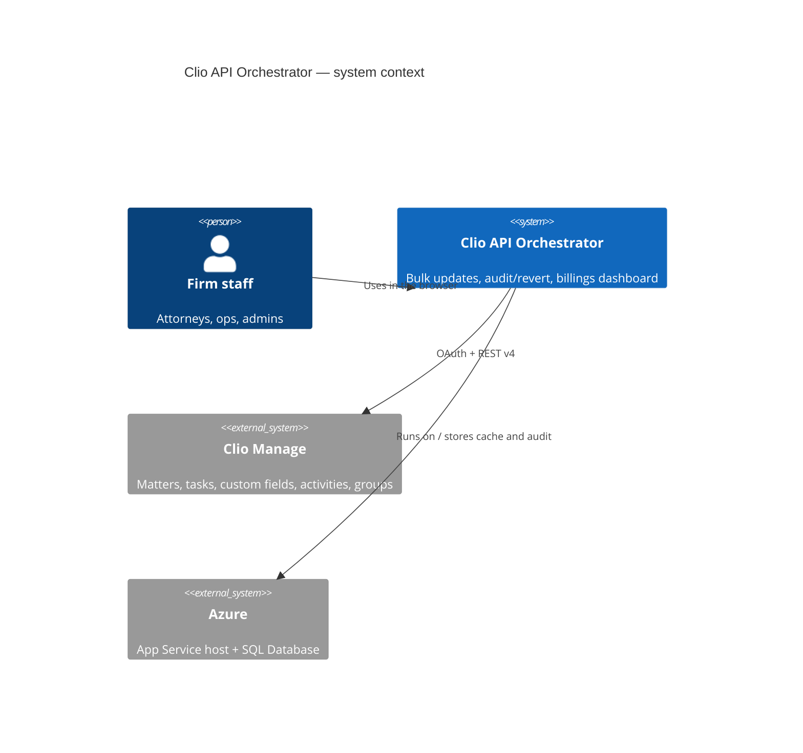
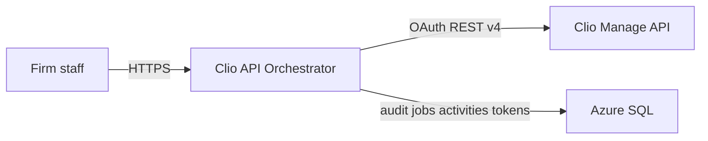

# System context

**Audience:** non-technical stakeholders.

The Orchestrator is a **Quill & Arrow internal** web application. Attorneys and operations staff log in, upload CSVs or use the billing dashboard, and the app talks to **Clio Manage** on their behalf. Every bulk write is audited so a batch can be reviewed or reverted.

It does **not** replace Clio. It is a controlled, logged way to change many records and to chart activity without hammering Clio on every dashboard click.

If Mermaid C4 is unavailable in a viewer, the same picture:

## People

- **Staff** — log in with the app’s own accounts today (not Microsoft Entra yet). Use Bulk Operations, Audit Log, Billings dashboard.
- **You (operator)** — deploy from VS Code, re-authorize Clio OAuth, watch jobs.

## External systems

| System | Role |
|---|---|
| Clio Manage | Source of truth for matters, tasks, custom fields, users/groups, time/expense activities |
| Azure App Service | Hosts the Python API and the built React SPA |
| Azure SQL | Audit log, Clio token row, activity cache, bulk job progress |

## Out of scope (today)

Microsoft Entra SSO and network IP allowlisting are planned, not implemented. See [[THREAD_HANDOFF]].
