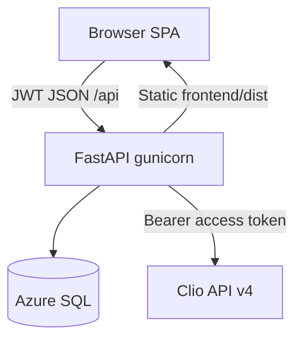

# Containers

**Audience:** technical stakeholders and a new engineer.

One Azure App Service process serves both the API and the compiled SPA. Gunicorn runs **multiple workers**. Anything that must be visible across workers (job progress, audit, tokens, billing cache) lives in **Azure SQL**, not in RAM.

## Containers

| Container | Code                          | Runtime                                                  |
| --------- | ----------------------------- | -------------------------------------------------------- |
| Web UI    | `frontend/` (Vite, React)     | Built to `frontend/dist`, mounted at `/`                 |
| API       | `backend/main.py`             | Azure App Service, gunicorn workers                      |
| Database  | tables in [[Data_Dictionary]] | Azure SQL (local SQLite possible for some tables in dev) |
| Clio      | none (vendor)                 | `https://app.clio.com/api/v4`                            |

## API internals (still one container)

Routers registered in [`backend/main.py`](../../backend/main.py): health, auth, OAuth, matters, custom fields, document templates, audit, preview, execute, CSV templates, billing.

Shared libraries at repo root: [`clio_client.py`](../../clio_client.py), [`operations.py`](../../operations.py).

Job registry: [`backend/routes/_bulk_jobs.py`](../../backend/routes/_bulk_jobs.py). Billing refresh has its own background thread + SQL meta in [`backend/routes/billing.py`](../../backend/routes/billing.py).

## Auth vs Clio OAuth

Two different logins:

1. **App login** — `POST /api/auth/login` JWT (~8 hours). Protects our routes.
2. **Clio OAuth** — `/api/oauth/login` stores access/refresh in `clio_tokens` (Azure) or a local token file.

## Azure gateway

HTTP in front of App Service dies around **230 seconds**. Long work returns `{ job_id }` immediately; the SPA polls `GET /api/execute/jobs/{id}` or billing refresh status. See [[ADR-002-background-jobs-for-azure-gateway]] and [[Bulk_Preview_Execute_Cancel]].
