# Billing refresh from Clio

Dashboard reads `activities_cache`. Refresh pulls ~190 days from Clio in calendar-month windows, upserts, then deletes cache rows in that window whose ids were not in the live pull (orphans = deleted in Clio).

```mermaid
flowchart TD
  start[POST /billing/refresh]
  start --> thread[Background thread]
  thread --> month[Next calendar month in window]
  month --> pull[Page Clio activities by date]
  pull --> upsert[Upsert activities_cache]
  upsert --> orphans[cached_ids minus live_ids]
  orphans --> del[Delete orphan rows]
  del --> more{More months?}
  more -->|yes| month
  more -->|no| meta[Update billing_cache_meta]
  meta --> done[Refresh status ok]
```

UI polls `GET /api/billing/refresh/status`. Same Azure timeout reason as bulk jobs.

Related: [[Billing_Cache]], [[ADR-001-azure-sql-activity-cache]]
