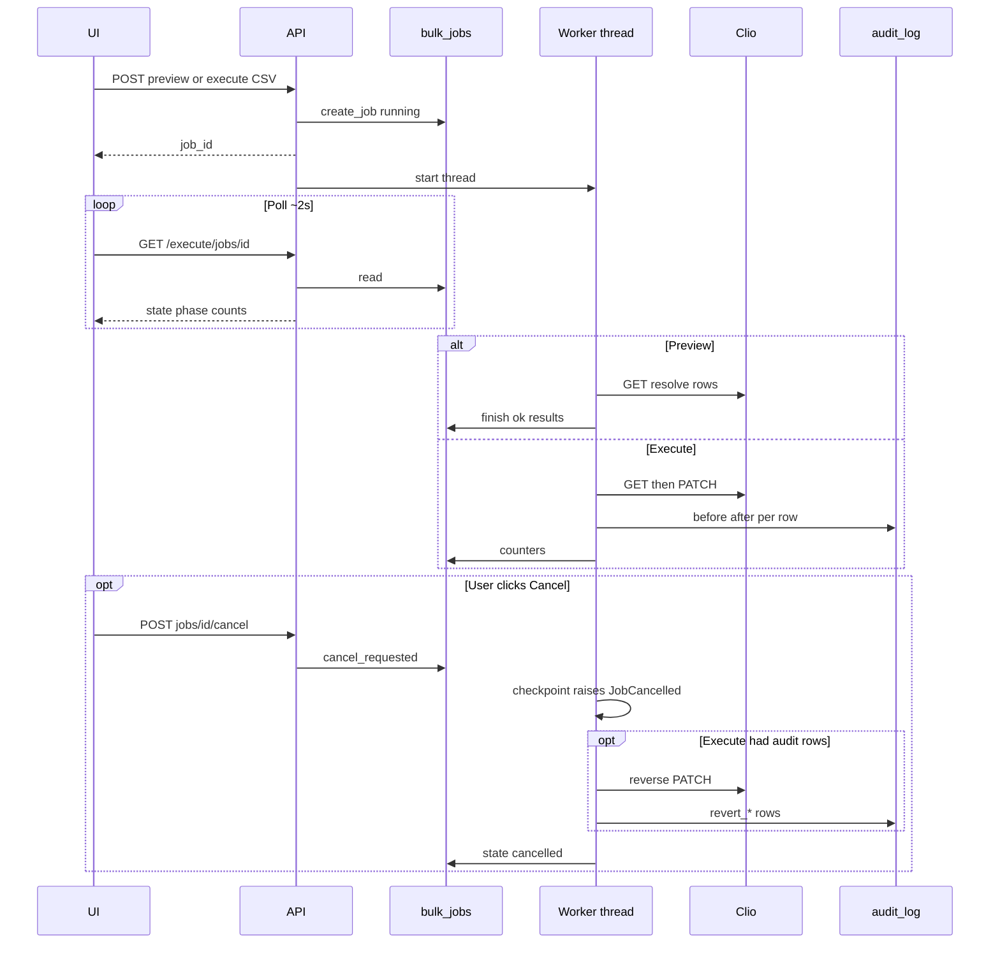

# Bulk preview, execute, cancel

Preview is Clio **reads** only. Execute **writes**. Cancel on preview stops the loop. Cancel on execute stops the loop then reverse-PATCHes every successful audit row for that job id.

Closing the browser is **not** the cancel path. See [[Reliability]].

Related: [[Bulk_Jobs]], [[ADR-004-cooperative-cancel-and-rollback]]
