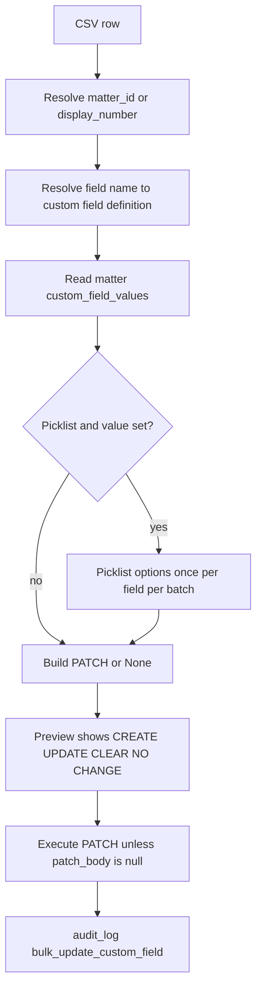

# Custom field bulk update

Each CSV row is one matter + one field. Blank `value` means **CLEAR** (`_destroy` on the existing custom field value instance), not “skip as invalid.” Already-empty + blank value is `NO CHANGE` (no PATCH).

Preview caching: picklist options memoized; matter resolve + CFVs combined when Clio returns them. Still one Clio hit per distinct matter.

Related: [[ADR-005-blank-custom-field-clears]], [[Bulk_Jobs]]
