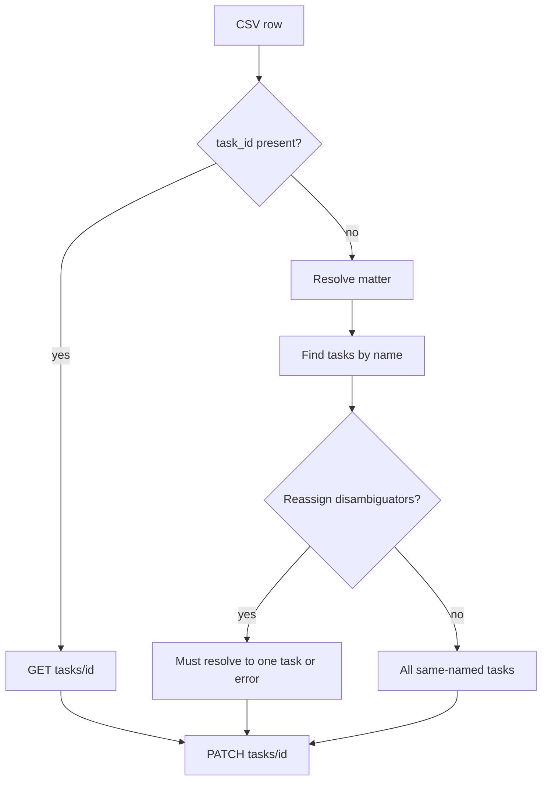

# Task reassign vs task update

Two modules, two CSVs.

**Bulk Reassign Tasks** — change assignee. Optional Status Override (including complete). Status Review for non-pending/non-complete unless override. Match by `task_id`, or matter + `task_name`, plus optional `task_description`, `due_at`, `current_assignee`.

**Bulk Update Tasks** — PATCH any allowed scalar/enum fields plus assignee / task_type. Blank field columns mean “do not change.” Status is just another column (`pending`, `in_progress`, `in_review`, `complete`, `draft`).

Revert: reassign restores previous assignee (cannot restore “unassigned” if Clio requires an assignee). Update restores `before_value` JSON field set.

Related: [[ADR-006-task-identity-and-disambiguators]], [[BulkOperationsPage]]
